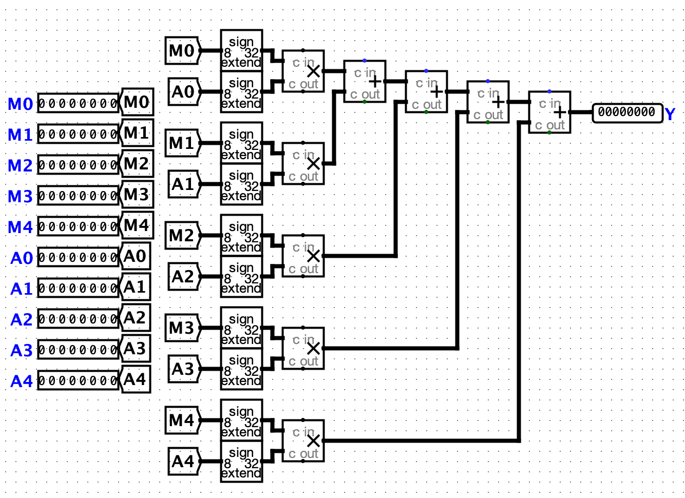

# Functional Computation Kernel
FuCK: Functional Computation kernel.

The functional computation kernel is a custom computer chip designed to accelerate GEMV (general matrix-vector multiplication) in neural networks. 
It is implemented in VHDL hardware description language and can be executed on low-cost Altera Max 10 FPGA devices. In addition, the project includes 
a custom assembler and emulator for compiling and testing programs written for the chip.

## Background


Neural network inference consists of a series of matrix-vector multiplication operations. A sum is computed of the product of input/neuron activation values 
and each of their respective weight values. FuCK is a custom embedded device for accelerating the computation of these sums. It is a circuit, written in VHDL,
which may be compiled and uploaded to an Altera Max 10 device. It achieves this by integrating with the Altera Max 10s embedded multiplier gates, which allow 
it to perform multiple multiplications simultaneously. The chip also handles DDR (double data rate) transmissions, allowing users to write values to its memory 
at both low and high clock signals. A GEMV involving 5 weights and 5 multiplicands can hence be computed in 2 clock cycles.

FuCK enables neural network inference on small, inexpensive, low-power devices. It can be integrated with a Raspberry Pi, arduino, or other microprocessor
to implement simple neural networks. In addition to the chip, this repository includes an assembler and emulator. The assembly language consists of the
following operations: `RST, LOAD, EXEC, RPRT`. `RST` resets all internal memory, `LOAD` loads up to 5 weights, `EXEC` multiplies the in-memory weights by
an additional 5 multiplicands, and `RPRT` is a virtual instruction (only recognized by the emulator) for returning the latest output. An example is illustrated
below:
```asm
RST;
LOAD -1 2 -3 4 -5;
EXEC 5 -4 3 -2 1;
RPRT;
```

The `LOAD` and `EXEC` instructions expect 5 integer operands. All operations must be terminated with a semicolon `;`.

## Install
This project requires a [python](https://www.python.org/) interpreter for running the compiler and assembler. If you wish to compile the VHDL code, 
you may use [Quartus Lite](https://www.intel.com/content/www/us/en/software-kit/660907/intel-quartus-prime-lite-edition-design-software-version-20-1-1-for-windows.html) or 
an implementation of [ModelSim](https://www.intel.com/content/www/us/en/software-kit/750368/modelsim-intel-fpgas-standard-edition-software-version-18-1.html).

Begin by cloning the repository:
```bash
git clone https://github.com/zeim839/osc-mini-hack.git
```

Install required python dependencies:
```bash
python -m pip install numpy
```

If you wish to run the python demo, you'll also require TensorFlow:
```bash
python -m pip install tensorflow
```

## Usage
First, ensure you're in the root project directory:
```bash
cd osc-mini-hack
```

To compile an assembly source file, run:
```bash
python kernel compile myFile.asm
```

Which will produce a binary file called `program.bin`. The contents of the file may be loaded into a physical implementation of the chip, or alternatively executed on the emulator.

To execute a program on the emulator, run:
```bash
python kernel exec program.bin
```

For instructions on writing programs, see the [Background](#background) section.

## Demo
The demo folder includes a demonstration of the assembler/emulator. It covers compiling a program, as well as implementing a simple neural network on the circuit. See the demo [README](demo/README.md) for instructions.

## License
[MIT](LICENSE)

Copyright (C) 2024 Michail Zeipekki
